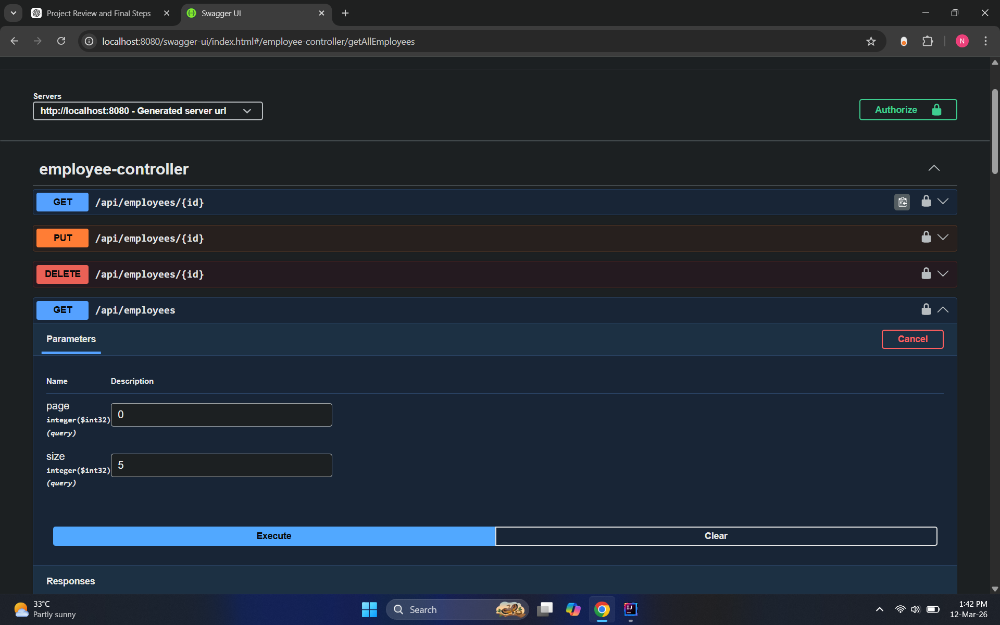
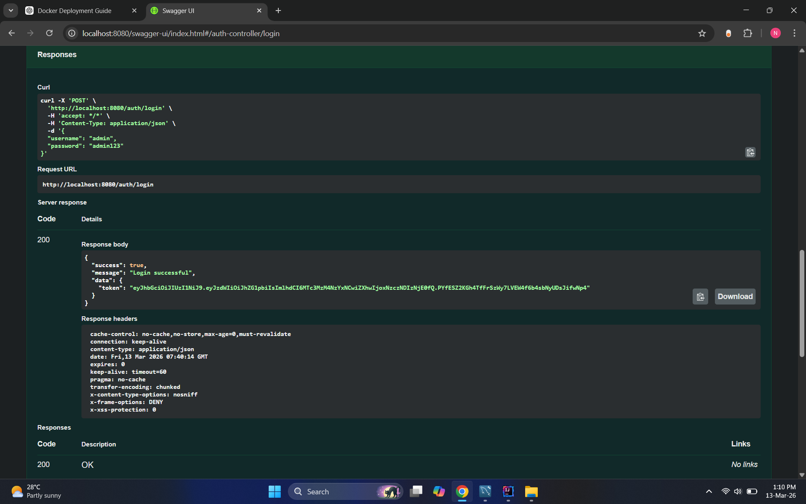
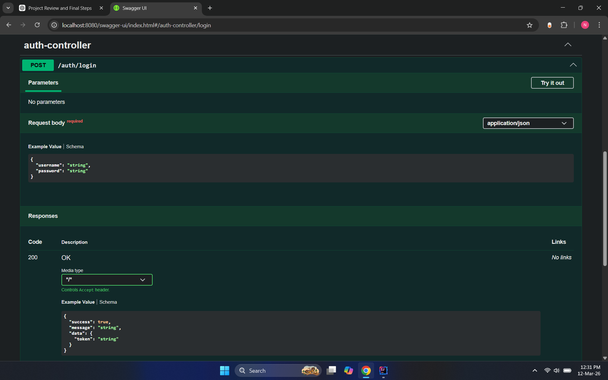
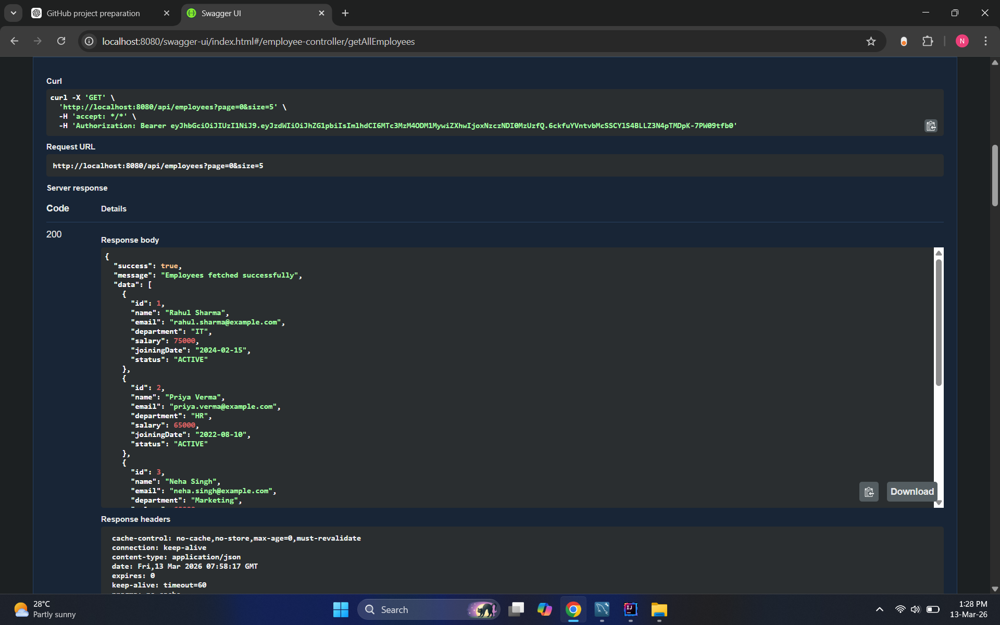
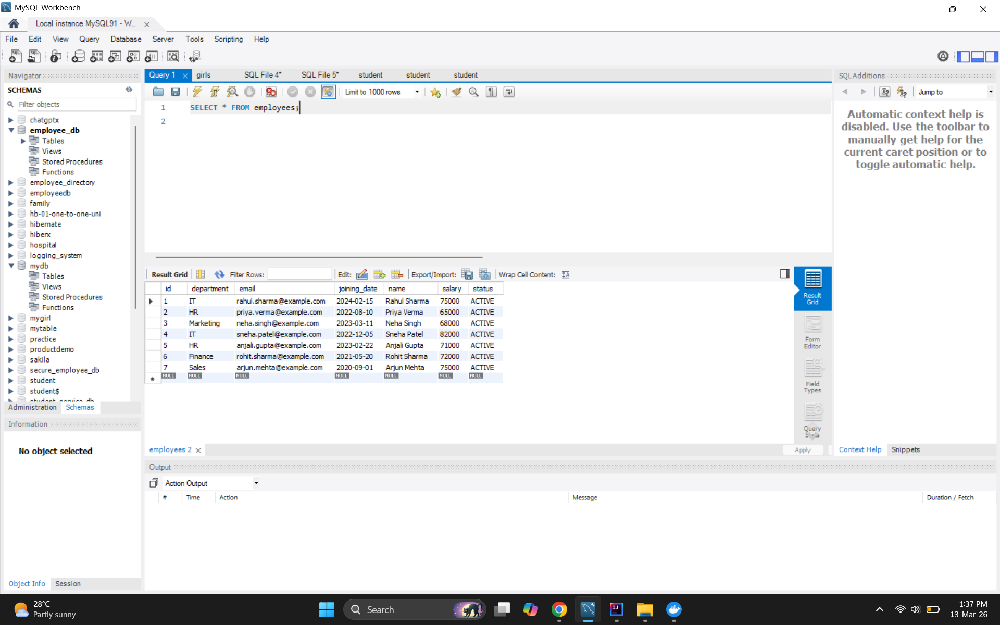
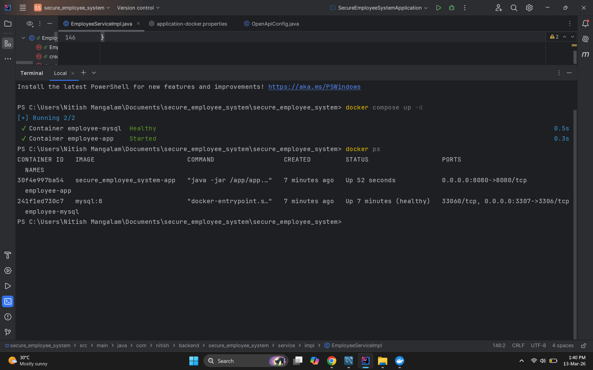

# Secure Employee Management System

A backend REST API built using **Spring Boot** that provides secure employee management with **JWT authentication**, **Spring Security**, **Docker containerization**, and **MySQL database integration**.

---

## Tech Stack

- Java
- Spring Boot
- Spring Security
- JWT Authentication
- Spring Data JPA
- MySQL
- Docker
- Docker Compose
- Swagger (OpenAPI)
- Maven

---

## Features

- Employee CRUD APIs
- JWT Authentication & Authorization
- Protected endpoints using Spring Security
- DTO pattern for request and response
- Global exception handling
- Standard ApiResponse wrapper
- Pagination support
- Swagger API documentation
- Docker containerization
- MySQL database container

---

## Project Architecture

Client → Controller → Service → Repository → Database

Security Flow:

Client → /auth/login → JWT Token → Authorization Header → Protected APIs

---

## API Documentation

Swagger UI available at:

http://localhost:8080/swagger-ui/index.html

---

## Docker Setup

Run the application using Docker:

docker compose up -d

Containers:

- employee-app (Spring Boot)
- employee-mysql (MySQL)

---

## Screenshots

### Swagger UI

### JWT Login

### Create Employee

### Pagination

### MySQL Data

### Docker Containers

---

## Author

Nitish Mangalam  
Java Backend Developer